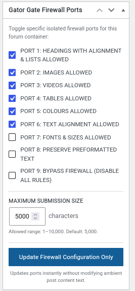

# Gator-Gate-Firewall

Advanced per-forum content filtering, clipboard copy-paste baggage reduction, and strict **default-deny text normalization** for the Gator-Gate-Editor with a bbPress forum.

### Protect Your Database at Scale
Gator-Gate-Firewall gives you granular control over what rich text, media, and markup are allowed to enter your bbPress database on a **per-forum basis**. By isolating heavy or bloated elements to designated areas, you drastically reduce database table growth, eliminate server CPU bottlenecks, and maintain lightning-fast load times as your community grows.

### Port Control Management
Content filtering is handled via simple checkboxes when creating or editing any individual forum. By default, everything is strictly stripped to plain text and spacing. When a port is allowed, that specific HTML content is permitted to pass through the firewall to be saved. This results in a cleaner database with improved read speeds and effortless scaling, while naturally reducing server resource consumption and hosting costs.

### Port Configuration
Opening and closing a port is a simple checkbox selection when you create or edit a forum:

### Extra Security for Videos
**Security Port 3:** Any iframe videos are changed to a placeholder token, such as `[embed width="400" height="224"]https://www.youtube.com/embed/watch?_ref[/embed]`, when being saved to the database. The Visual Editor, which is switched off by default in bbPress, is then re-enabled with a code snippet to process this placeholder for video previews and resizing. Hence, the **Gator-Gate-Editor** safely changes these embed placeholders back to active clean iframes on the front end as a secure workaround.

### Why This Approach Is Necessary (Technical Deep Dive)
You cannot get the standard WordPress `[embed]` tag to play natively because bbPress explicitly disables the core WordPress oEmbed layout filters inside forum posts. This reconversion method solves this problem through three distinct architectural protections:

#### 1. Bypassing the Disabled WordPress Filter
WordPress automatically runs a background filter called `the_content` to convert `[embed]` tags into playable iframes. However, bbPress intercepts this process and explicitly removes that hook. 

#### 2. Evading the Database Security Trap
Because the native WordPress oEmbed engine is turned off inside the forum ecosystem, bbPress treats the `[embed]` tag as ordinary plain text. If you save a raw `<iframe>` directly, the forum's strict `wp_kses` security filter catches it and deletes it entirely to prevent cross-site scripting (XSS) attacks. You might see the iframe as text in your forum because your forum's editor or security filter escaped the HTML characters to safely display the code as text instead of executing it.

#### 3. Standard Tokenization for Safety
Converting the incoming data block into a benign shortcode token allows bbPress to safely write it to the `wp_posts` database table without triggering security sanitization loops. The custom editor script then intercepts the raw text data on the front end, using JavaScript regex strings to dynamically swap the token back out for a valid browser viewport wrapper.

Converting video scripts into static placeholders prevents malicious code injections at the database level while safely restoring the interactive layout only inside a patched editor.

### Installation & Testing
This project is currently distributed as standalone PHP code snippets.
* **Test first**: Run all snippets in a sandbox or staging environment before going live.
* **Be cautious**: Exercise caution when installing or removing custom backend snippets.
* **Expect variances**: Database effects and site behaviour may vary depending on your server configuration.
* **Backup everything**: Always back up your website and database before installing or modifying snippets.

The easiest installation method is to copy and paste the snippets into a WordPress code snippet manager, such as **Fluent Snippets**.

### Licensed
Licensed under GPL v2 or later.

AI-generated and AI-assisted code is provided AS IS without warranty. Users are responsible for testing and validating the code before deploying it in production environments.

## ☕ Voluntary Support
[tinfoilwho.com](https://tinfoilwho.com/mission-support/)
